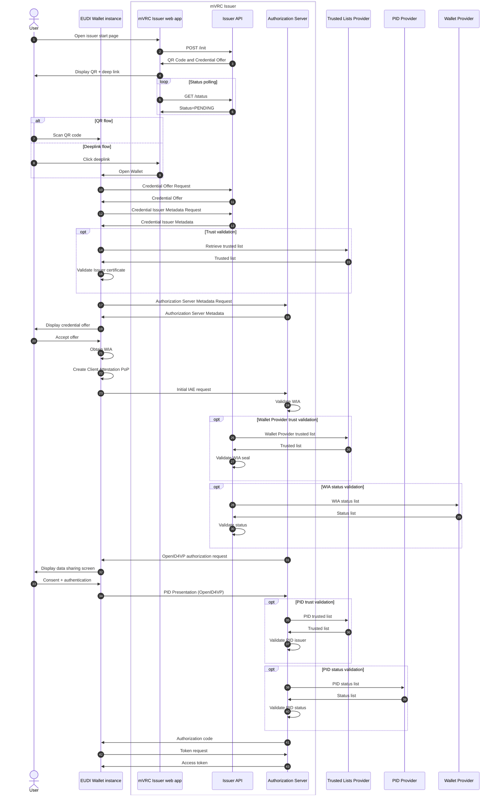
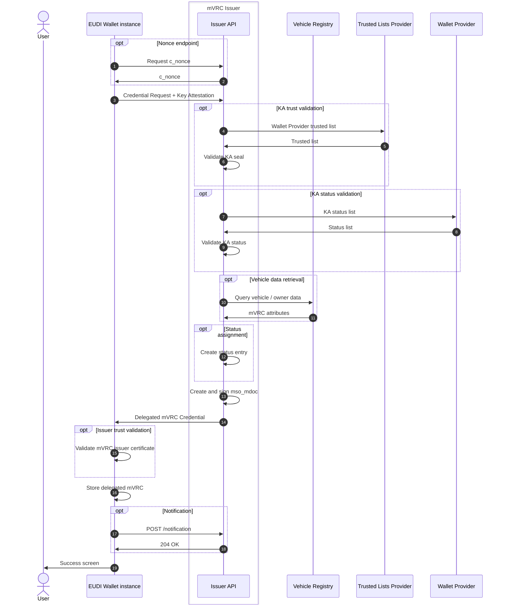

```mermaid
sequenceDiagram
  autonumber

  actor U as User
  participant W as EUDI Wallet instance

  box mVRC Issuer
    participant B as mVRC Issuer web app
    participant I as Issuer API
    participant AS as Authorization Server
  end

  participant TL as Trusted Lists Provider
  participant PD as PID Provider
  participant WP as Wallet Provider

  %% =========================
  %% Credential Offer
  %% =========================

  U->>B: Open issuer start page

  B->>I: POST /init
  I->>B: QR Code and Credential Offer

  B->>U: Display QR + deep link

  loop Status polling
    B->>I: GET /status
    I->>B: Status=PENDING
  end

  alt QR flow
    U->>W: Scan QR code
  else Deeplink flow
    U->>B: Click deeplink
    B->>W: Open Wallet
  end

  W->>I: Credential Offer Request
  I->>W: Credential Offer

  W->>I: Credential Issuer Metadata Request
  I->>W: Credential Issuer Metadata

  opt Trust validation
    W->>TL: Retrieve trusted list
    TL->>W: Trusted list
    W->>W: Validate Issuer certificate
  end

  W->>AS: Authorization Server Metadata Request
  AS->>W: Authorization Server Metadata

  W->>U: Display credential offer
  U->>W: Accept offer

  %% =========================
  %% Authentication & Authorization
  %% =========================

  W->>W: Obtain WIA
  W->>W: Create Client Attestation PoP

  W->>AS: Initial IAE request

  AS->>AS: Validate WIA

  opt Wallet Provider trust validation
    I->>TL: Wallet Provider trusted list
    TL->>I: Trusted list
    I->>I: Validate WIA seal
  end

  opt WIA status validation
    I->>WP: WIA status list
    WP->>I: Status list
    I->>I: Validate status
  end

  AS->>W: OpenID4VP authorization request

  W->>U: Display data sharing screen
  U->>W: Consent + authentication

  W->>AS: PID Presentation (OpenID4VP)

  opt PID trust validation
    AS->>TL: PID trusted list
    TL->>AS: Trusted list
    AS->>AS: Validate PID issuer
  end

  opt PID status validation
    AS->>PD: PID status list
    PD->>AS: Status list
    AS->>AS: Validate PID status
  end

  AS->>W: Authorization code

  W->>AS: Token request

  AS->>W: Access token
```

---

```mermaid
sequenceDiagram
  autonumber

  actor U as User
  participant W as EUDI Wallet instance

  box mVRC Issuer
    participant I as Issuer API
  end

  participant R as Vehicle Registry
  participant TL as Trusted Lists Provider
  participant WP as Wallet Provider

  %% =========================
  %% Credential Issuance
  %% =========================

  opt Nonce endpoint
    W->>I: Request c_nonce
    I->>W: c_nonce
  end

  W->>I: Credential Request + Key Attestation

  opt KA trust validation
    I->>TL: Wallet Provider trusted list
    TL->>I: Trusted list
    I->>I: Validate KA seal
  end

  opt KA status validation
    I->>WP: KA status list
    WP->>I: Status list
    I->>I: Validate KA status
  end

  opt Vehicle data retrieval
    I->>R: Query vehicle / owner data
    R->>I: mVRC attributes
  end

  opt Status assignment
    I->>I: Create status entry
  end

  I->>I: Create and sign mso_mdoc

  I->>W: Delegated mVRC Credential

  opt Issuer trust validation
    W->>W: Validate mVRC issuer certificate
  end

  W->>W: Store delegated mVRC

  opt Notification
    W->>I: POST /notification
    I->>W: 204 OK
  end

  W->>U: Success screen
```

---

Diagram 1 = Credential Offer + Authentication + Authorization
Diagram 2 = Credential Issuance